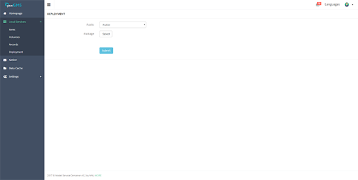
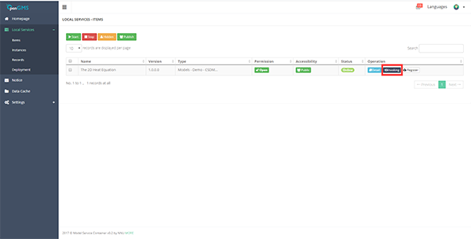
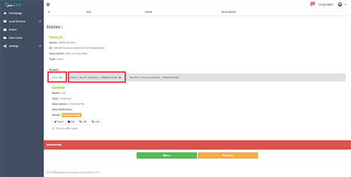

# Model Interoperable Engine

[](http://geomodeling.njnu.edu.cn/)

## Introduction
Engine for model interoperation among model standards. This project aims to build kinds of engines for interoperation among BMI (from CSDMS), OpenMI, OpenGMS and etc. 

## Software Architecture
Software architecture description. 

## Installation

Before install it, please ensure your PC has Python 3.7 and pip already. There are two methods to install package.

### 1. Download
Download [pip package](standard-demo/bmi/release/BMI-OpenGMS-Engine-0.1.2.tar.gz)

### 2. Install pip package
Open cmd window in Windows or shell in Linux or MacOS, pip.

Type `pip3 install bmi-opengms-engine`

## Usage

### Class : BMI-OpenGMS-Engine

* Function : convertBMI2OpenGMS(bmiComponent, componentName, supplement = None)
* Parameters : 
    * bmiComponent `necessary` : Full path of BIM component file or directory. 
    * componentName `necessary` : Class name of imported module.
    * supplement `optional` : a `json` file for supplement information, to supply the information that BMI don't have and OpenGMS need.
    ``` json
        {
            "AttibuteSet" : {
                "Description" : "BMI Component Description",
                "Wiki" : "https://csdms.colorado.edu/",
                "Keywords" : [],
                "Category" : {
                    "Principle" : "CSDMS",
                    "Path" : "Models - xxxx"
                }
            },
            "Runtime" : {
                "Version" : "0.1.0",
                "HardwareConfigures" : [
                    {
                        "key" : "",  // The key of hardware dependency, e.g. CUP
                        "value": ""  // The value of hardware dependency. e.g. 1.0
                    }
                ],
                "SoftwareConfigures" : [
                    {
                        "key" : "",    // The key of software dependency, e.g. CUP
                        "value": "",   // The value of software dependency. e.g. 1.0
                        "platform": "" // The platform of software dependency. e.g. WIN86
                    }
                ],
                "Assemblies" : [
                    {
                        "key" : "", // The kay of assembly, e.g. GDALRasterMapping.exe
                        "value": "" // The value of assembly. e.g. $(DataMappingPath)\GDALRasterMapping\
                    }
                ]
            },
            "AdditionFiles" : [
                "DependencyFile" // Full path of dependency, can be a file or a directory, e.g. E:/ComponentA or D:/ComponentB.py
            ]
        }
    ``` 
* Return : Void
The package will be generation in the same folder with BMI component

the package can be deployed in [the wrapper system of OpenGMS (GeoModelServiceContainer)](https://github.com/franklinzhanggis/wrappersystem)

### Demo

#### Demo 1 - HeatMap

HeatMap is the CSDMS BMI offical demo.

##### Step 1 Run the script below (or run the script in test file)

``` python

def test_for_bmi_opengms_engine():
    dirname = os.path.dirname(__file__)
    BMIOpenGMSEngine.convertBMI2OpenGMS(dirname + "/heat", "BmiHeat", dirname + "/data/bmi_heat_map_supplement.json")

```

Run the script above and generate the package.

##### Step 2 Download the wrapper system (release version) or visit public wrapper system online

[windows](http://106.14.78.235/doc/ContainerPacking_2019-10-25.zip)

Public Online Wrapper System (http://106.14.78.235:8060), and deploy the model service by the package




##### Step 3 Invoke the service by test data

Click the invoke button



Upload data for model invoking

Data configuration (test data can be found in `test\data`):

* init.yaml - Init
* input_plate_surface__temperature.dat - INPUT_plate_surface__temperature



## Contributors
### Founders/Designers
Min Chen (<chenmin0902@163.com>) 

Yongning Wen (<wenyn@msn.com>)

Songshan Yue (<yss123yss@126.com>)

Fengyuan Zhang (<franklinzhang@foxmail.com>)

### Coders
Fengyuan Zhang (<franklinzhang@foxmail.com>) 

All codes are used in [OpenGMS](http://geomodeling.njnu.edu.cn/) platform